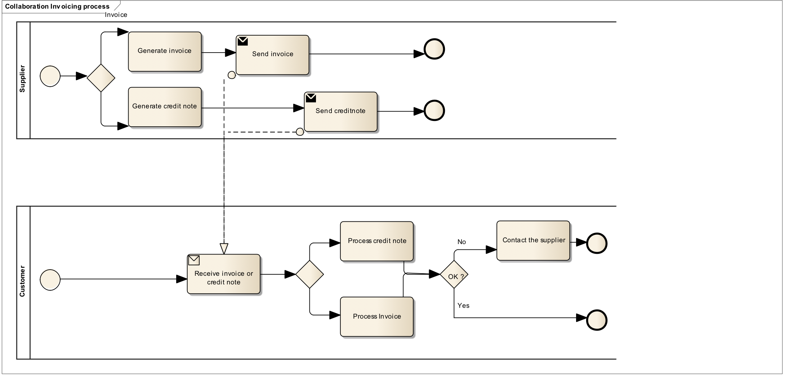

= Summary invoicing process, pattern 1.

In the summary invoicing process, pattern 1, the supplier sends a debit note to the buyer with each delivery and the buyer uses the information in the debit note to verify the reception of the items. The debit note is focused on providing information about the items that are being delivered. At the end of a period (usually a month) the supplier sends a single invoice that summarises the items that were send during that period. The invoice contains represents a claim for payment and contains the necessary tax information.

The invoicing process is shown in this work flow:

* A supplier can send one or more debit note along with the deliveries of items. The debit note refers to the order and provides information about the items and their quantities. The customer can use the debit note to control the receiption of the items.

* A the end of a period a supplier issues and sends an invoice to a customer. The invoice summarizes all the items delivered during the period and references the debit notes.

* The customer receives the invoice and processes it in the invoice control system leading to one of the following results:
  .. The customer fully approves the invoice, posts it in the accounting system and passes it on to be paid.
  .. The customer completely rejects the invoice, contacts the supplier and requests a credit note.
  .. The customer disputes parts of the invoice, contacts the supplier and requests a credit note and a new invoice.

The diagram below shows the basic invoicing process with the use of this PEPPOL Japan summary invoice BIS profile. This process assumes that both the invoice and the credit note are exchanged electronically.

This profile covers the following invoice processes:
P1:: Invoicing of deliveries of goods and services against purchase orders, based on a contract
P2:: Invoicing deliveries of goods and services based on a contract
P3:: Invoicing the delivery of an incidental purchase order
P4:: Pre-payment
P5:: Spot payment
P6:: Payment in advance of delivery
P7:: Invoices with references to a despatch advice
P8:: Invoices with references to a despatch advice and a receiving advice
P9:: Credit notes or invoices with negative amounts, issued for a variety of reasons including the return of empty packaging

